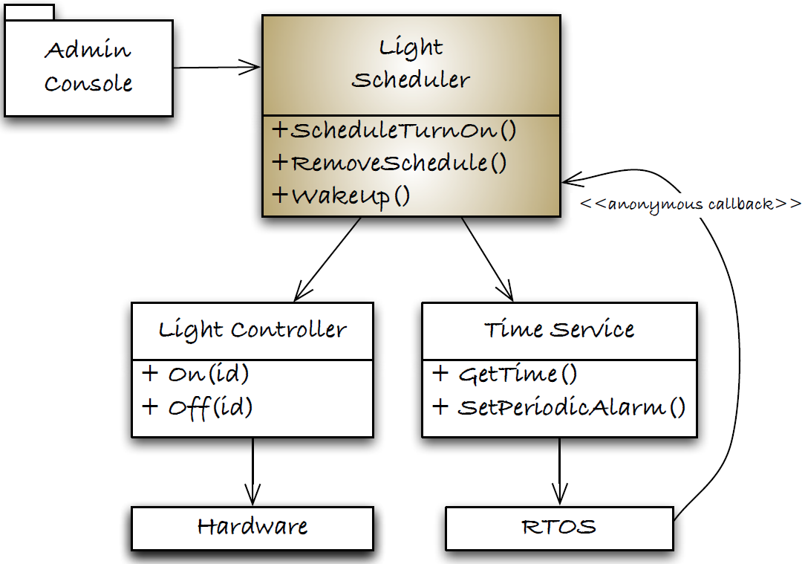
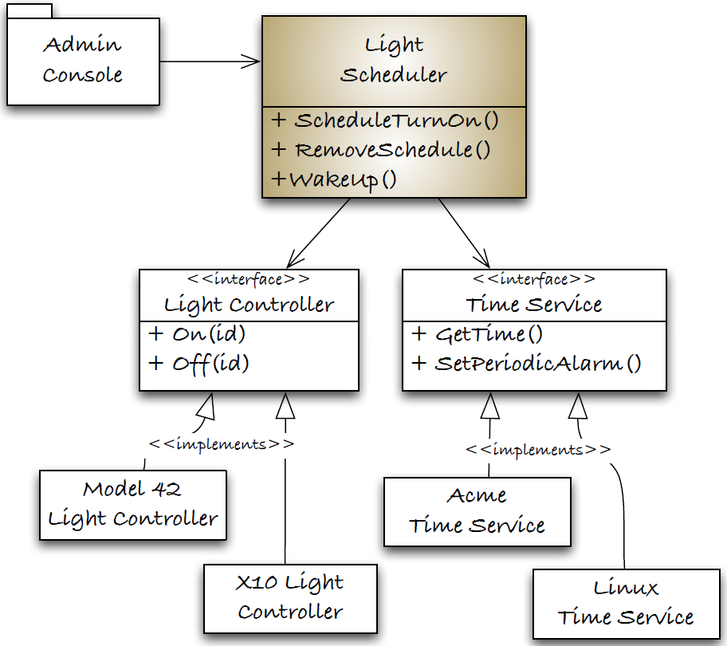
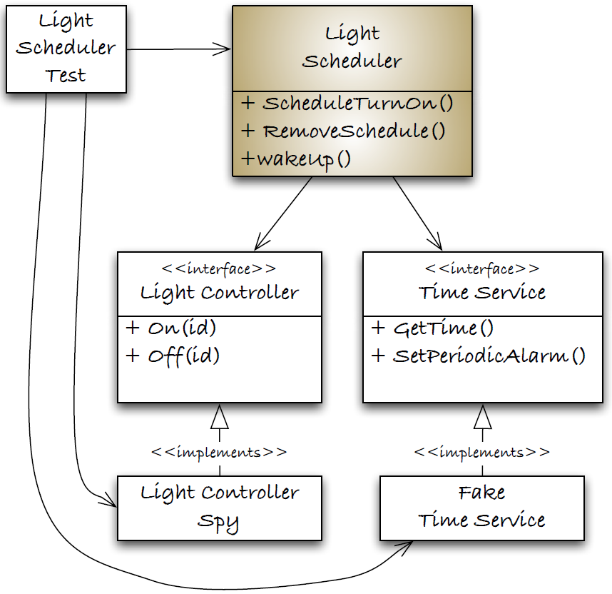
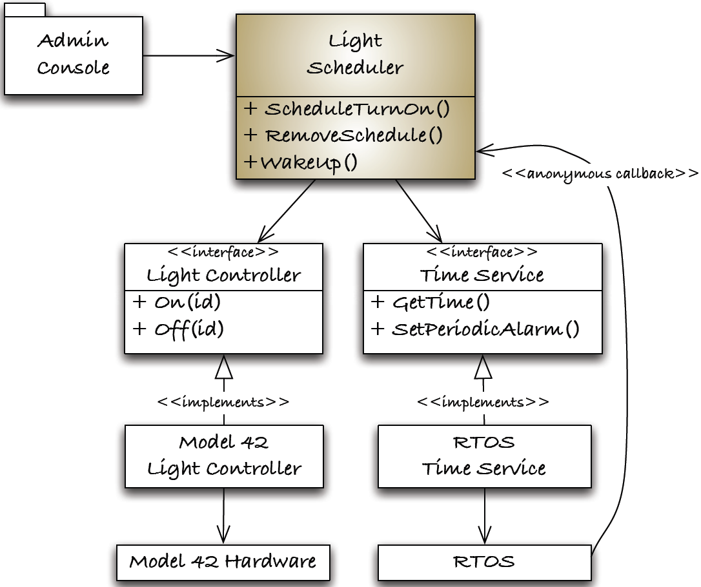
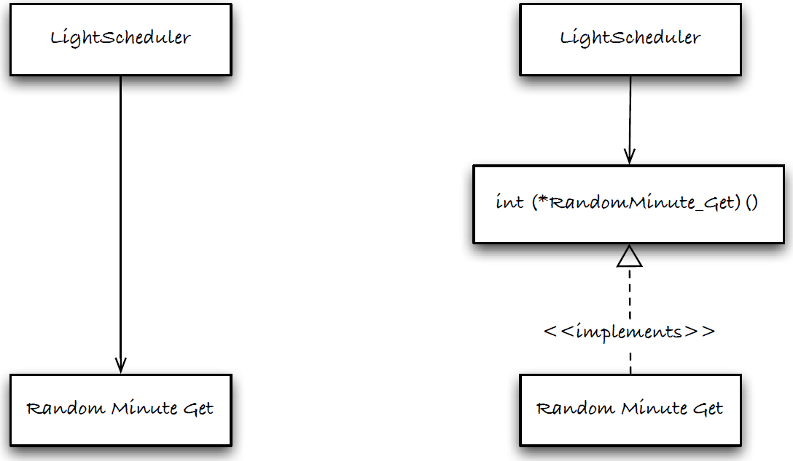

[SOLID Design for Embedded C](https://wingman-sw.com/papers/SOLIDInC.grenning.v1r0.pdf)

**Паттерны проектирования SOLID для встраиваемых систем на C**

Embedded Systems Conference, San Jose, CA, May 2012

Class ESC-231

By James W. Grenning

Самый распространенный шаблон проектирования, который я видел в коде на C - это неразбериха (free-for-all) в вызовах функций и структурах данных. Не весь код на C - бардак, но уверен, что его много. Это непросто, но С-код не обязательно должен быть бардаком. Хороший дизайн - модульный, а модули обладают высокой зацепление (high cohesion) и слабой связностью (loose coupling). Мы слышали эти термины годами, но что они означают?

Чтобы построить хороший дизайн, мы должны изменить обычный способ оценки дизайна с Not Invented Here (Не придумывай, NIH) на использование принципов проектирования SOLID. Принципы проектирования SOLID дают нам некоторые конкретные вещи, которые нужно искать в конструкции для разработки модулей с высокой зацепление (high cohesion) и слабой связностью (loose coupling). Пять принципов проектирования, описанных в книге Боба Мартина (Agile Software Development, Principles, Patterns, and Practices [Mar02]), означают слово SOLID.

- S	Принцип единственной ответственности (Single Responsibility Principle)
- O	Принцип открытости/закртытости (Open Closed Principle)
- L	Принцип подстановки Лисков (Liskov Substitution Principle)
- I	Принцип разделения интерфейса (Interface Segregation Principle)
- D	Принцип инверсии зависимостей (Dependency Inversion Principle)

Давайте рассмотрим принципы проектирования SOLID, которые являются проверенными принципами, помогающими создавать более совершенные конструкции. Они происходят из объектно-ориентированного мира, но нет причин, по которым мы не можем применить их и получить от них пользу при программировании в C. Мы рассмотрим примеры кода, использующего эти принципы.

Как оказалось, создание кода, пригодного для модульного тестирования, приводит к лучшему дизайну. Тестируемый код должен быть модульным и слабо связанным. В моей книге «Test-Driven Development for Embedded C» [Gre11] я рассказываю о том, как разработка на основе тестирования может помочь в разработке дизайна, но в этой статье мы в основном рассмотрим некоторые способы структурирования кода на C для создания проектов, которые могут пройти испытание временем. Начнем с рассмотрения принципов и их некоторых моделей дизайна на C для их реализации.

# Принцип единственной ответственности
Принцип единственной ответственности (Single Responsibility Principle, SRP) [Mar02] гласит, что модуль должен иметь одну ответственность. Модуль должен отвечать за одного и только за одного актора. У него должна быть единственная причина для изменения. Применение SRP приводит к модулям с хорошим зацеплением, модулям, которые состоят из функций и данных с единой целью - в двух словах, модулям, которые выполняют работу и делают ее хорошо.

Модуль, который обращается к многочисленным структурам данных и глобальным переменным, выполняя всю работу, не следует SRP. Эта схема, которая является частью конструкции домашней системы автоматизации, иллюстрирует SRP, разделяя различные проблемы:



Подсистема консоли администратора может предписывать модулю LightScheduler включать или выключать свет в запланированное время. Он отвечает за управление графиком освещения. LightController взаимодействует с оборудованием, которое может включать или выключать некоторый свет по своему ID. TimeService несет ответственность за предоставление времени и периодическое пробуждение своего клиента через механизм обратного вызова.

Когда модули хорошо названы с хорошо названными функциями, обязанности должны быть ясны. В сложных объяснениях должно быть мало необходимости. Модули вместе со своими тестами рассказывают свою историю.

К функциям можно применить SRP. Хорошо сфокусированные обязанности помогают понять, где следует вносить изменения по мере развития требований. Когда этот принцип не соблюдается, вы получаете функции из 1000 строк, участвующие в глобальных оргиях функций и данных.

# Принцип открытости/закрытости
Принцип открытости/закрытости (Open Closed Principle, OCP), описанный Бертраном Мейером в работе Object-Oriented Software Construction [Mey97] и интерпретированный Бобом Мартином, гласит, что модуль должен быть «открыт для расширения, но закрыт для модификации».

Позвольте мне объяснить OCP метафорой: порт USB может быть расширен (вы можете подключить любые совместимые устройства USB в порт), но не нуждается в модификации, чтобы принять новое устройство. Итак, компьютер, имеющий USB-порт, открыт для расширения, но закрыт для модификации для совместимых USB-устройств.

Когда какой-либо аспект дизайна следует за OCP, его можно расширить, добавив новый код, а не модифицируя существующий. Можно сказать, что LightScheduler (из предыдущего примера) открыт для расширения для новых видов LightControllers. Почему? Если интерфейс подчиненный, то вызывающий код (клиент) не заботится о типе вызываемого кода (сервер). OCP поддерживает замену поставщиков услуг таким образом, что клиенту не требуется никаких изменений для размещения нового сервера. Эта диаграмма показывает, что LightScheduler может работать без изменений с контроллерами LightControllers модели 42 и X10, а также с версиями TimeService для Acme и Linux.



Конструкция, которая следует OCP и SRP, является более тестируемой. Во время тестирования мы можем создать сборку, которая предоставляет тестовый заглушку, например:



Это означает, что мы не можем позволить знаниям по аппаратному обеспечению или внедрению ОС проникнуть в LightScheduler. Эта конструкция позволяет заменять зависимые модули. В C заголовочный файл является интерфейсом, а C-файл - реализацией. Мы можем использовать компоновщик для подстановки в разных версиях LightControllers и TimeServices. Но заменяемость - это нечто большее, чем наличие одного и того же интерфейса.

# Принцип подстановки Лисков

Принцип подстановки Лисков (Liskov substitution principle, LSP) был определен Барбарой Лисков в ее статье «Абстракция и иерархия данных» [Lis88]. Перефразируя свою работу, LSP говорит, что клиентским модулям не должно быть дела до того, с каким видом серверных модулей они работают. Модули с одинаковым интерфейсом должны быть заменяемыми без каких-либо специальных знаний в вызывающем коде.

Пока LightScheduler не должен вести себя по-другому при взаимодействии с тестовой заглушкой, LightControllerSpy, дизайн придерживается LSP.

Принцип подстановки Лисков может звучать очень похоже на принцип открытости/закрытости. Это потому, что OCP и LSP - две стороны одной медали. Но у LSP есть больше, чем просто интерфейс, который связывает или совместимый тип указателя функции. Значение вызовов должно быть одинаковым. Ожидания и клиента, и сервера должны быть выполнены.

Ничего дополнительного от LightScheduler не требуется, когда он взаимодействует с LightControllerSpy или производственным LightController. Не надо устанавливать никаких дополнительных предварительных условий, и никакие постусловия не ослабляются. LightControllerSpy и LightController не только синтаксически заменяемы, но и семантически заменяемы с точки зрения LightScheduler.

# Принцип разделения интерфейсов

Принцип разделения интерфейсов (Interface Segregation Principle, ISP) [Mar02] предполагает, что клиентские модули не должны зависеть от «жирных» интерфейсов. Интерфейсы должны быть адаптированы к потребностям клиента. Например, TimeService, имеет очень сфокусированный интерфейс. В нем отображаются только те операции, которые необходимы приложению.



В целевой операционной системе может быть гораздо больше функций, связанных со временем. Целевая ОС старается быть всем для каждого приложения, в то время как TimeService ориентирован на нужды этой системы. Настраивая интерфейсы, мы ограничиваем зависимости, делаем код более легко портируемым и облегчаем тестирование кода, использующего интерфейс.

# Принцип инверсии зависимостей

В принципе инверсии зависимостей (Dependency Inversion Principle, DIP) [Mar02] Боб Мартин говорит нам, что высокоуровневые модули не должны зависеть от низкоуровневых модулей. И то, и другое должно зависеть от абстракций. Он также говорит, что абстракции не должны зависеть от деталей. Детали должны зависеть от абстракций. Мы можем разорвать зависимости с помощью абстракций и интерфейсов.

В C DIP типизируется, когда мы используем указатель на функции, чтобы разорвать нежелательную прямую зависимость. Слева на этой схеме LightScheduler зависит непосредственно от RandomMinute_Get. Стрелка указывает на зависимость. Верхний уровень напрямую зависит от деталей.



В правой части рисунка показана инвертированная зависимость. Здесь верхний уровень зависит от абстракции, которая представляет собой интерфейс в виде указателя на функцию. Детали также зависят от абстракции; RandomMinute_Get() реализует интерфейс.

Операционные системы используют тот же механизм, чтобы код ОС не зависел непосредственно от вашего кода. Функция обратного вызова является формой инверсии зависимостей.

Инверсия зависимостей в C не обязательно должна включать указатели на функции. В C это больше состояние души. Когда мы посмотрим на шаблон Single Instance Module позже в статье, мы скроем структуры данных внутри C-файла, раскрывая только имя структуры. Там мы применяем DIP.

Мы используем DIP, когда:
- детали реализации скрываются за интерфейсом,
- интерфейс не раскрывает детали реализации,
- клиент вызывает сервер через указатель на функцию,
- сервер вызывает клиента через указатель на функцию

# Проектные модели SOLID в C

Принципы SOLID могут дать некоторое руководство, чтобы избежать неразберихи (free-for-all) в вызовах функций и структурах данных, слишком распространенной в программировании на Си. Теперь мы рассмотрим другие методы применения этих идей в C. Все примеры иллюстрируют SRP и DIP, поэтому я не буду называть их.

Каждая модель является более сложной, чем предыдущая модель. Каждая решает какую-то конкретную задачу проектирования ценой некоторой дополнительной сложности. Вы сможете решить, стоит ли сложность этого, когда мы рассмотрим несколько примеров. Вот четыре модели, которые мы рассмотрим:

|          Модель         |                Цель                         |
|-------------------------|---------------------------------------------|
|Абстрактный тип данных с<br>одним экземпляром|Инкапсулирует внутреннее состояние модуля,<br>если требуется только один экземпляр модуля|
|Абстрактный тип данных с<br>несколькими экземплярами|Инкапсулирует внутреннее состояние модуля<br>и допускает несколько экземпляров данных модуля|
|Динамический интерфейс|Позволяет назначать интерфейсные функции<br>модуля во время выполнения|
|Динамический интерфейс<br>по типу|Позволяет нескольким типам модулей с одним и тем же<br>интерфейсом иметь уникальные интерфейсные функции|

Каждая модель является более сложной, чем предыдущая модель. Я предлагаю вам выбрать модель, которая является самой простой, которая подойдет под ваши нужды. По мере того, как все меняется, и вы используете SOLID в своих проектах (и добавляете автоматические тесты), вы обнаружите, что ваш код намного мягче и гибче.

## Модуль с одним экземпляром

Для одноэкземплярных модулей заголовочный файл определяет все необходимое для взаимодействия с модулем. Заголовок LightController будет содержать только прототипы функций.

```cpp
void LightController_Create (void);
void LightController_Destroy (void);
void LightController_TurnOn (int id);
void LightController_TurnOff (int id);
```

Все, что можно скрыть, должно быть скрыто. Структуры данных, необходимые планировщику для выполнения своей работы, скрыты как переменные области действия файла в файле .c. Структуры данных планировщика не нужны в заголовке, потому что они не нужны никаким другим модулям. Это делает невозможным зависимость других модулей от структуры и гарантирует, что ответственность за ее целостность лежит на планировщике. Если enum или #define необходимы для взаимодействия с модулем, они будут включены в заголовочный файл (но в данном случае это не так).

## Многоэкземплярный модуль

Иногда приложению требуется несколько экземпляров модуля, содержащего различные данные и состояние. Например, приложению может потребоваться несколько FIFO структур данных. CircularBuffer является примером модуля с несколькими экземплярами. Каждый экземпляр CircularBuffer может иметь свою уникальную емкость и текущее содержимое. Вот как выглядит интерфейс к CircularBuffer:

```cpp
typedef struct _CircularBuffer * CircularBuffer;

CircularBuffer CircularBuffer_Create(int capacity);
void CircularBuffer_Destroy (CircularBuffer);
BOOL CircularBuffer_IsEmpty (CircularBuffer);
BOOL CircularBuffer_IsFull (CircularBuffer);
BOOL CircularBuffer_Put (CircularBuffer, int);
int CircularBuffer_Get (CircularBuffer);
int CircularBuffer_Capacity (CircularBuffer);
void CircularBuffer_Print (CircularBuffer);
BOOL CircularBuffer_VerifyIntegrity (CircularBuffer);
```

Это устоявшаяся дизайнерская модель, основанная на абстрактном типе данных Барбары Лисков [Lis74]. Члены struct _CircularBuffer не отображаются в заголовочном файле. Оператор typedef объявляет, что существует структура с заданным именем, но скрывает члены структуры для пользователей интерфейса. Это не позволяет пользователям CircularBuffer напрямую зависеть от данных в структуре. Структура определяется в файле .c, скрытом от просмотра. Не то чтобы это актуально, вот как будет выглядеть структура, определенная в верхней части файла .c.

```cpp
typedef struct _CircularBuffer
{
  int count;
  int index;
  int outdex;
  int capacity;
  int* values;
} _CircularBuffer;
```

## Динамический интерфейс

В динамическом интерфейсе мы решаем проблему дублирующей условной логики. Допустим, ваше приложение имеет многочисленные аппаратные реализации управления светом. Вероятно, ваш код имеет структуру данных для каждого типа LightDriver. Вероятно, существует перечисление или набор #define, таких как:

```cpp
typedef enum LightDriverType
{
  TestLightDriver,
  X10,
  AcmeWireless,
  MemoryMapped
} LightDriverType;
```

Также будет структура, которую все конкретные типы LightDriver будут включать в качестве своего первого члена, как это:

```cpp
typedef struct LightDriverStruct
{
  LightDriverType type;
  int id;
} LightDriverStruct;
```

Вот пример использования для конкретной структуры:

```cpp
typedef struct X10LightDriverStruct
{
  LightDriverStruct base;
  X10_HouseCode house;
  int unit;
  char message[MAX_X10_MESSAGE_LENGTH];
} X10LightDriverStruct;
```

Все это прекрасно, пока мы не перейдем к использованию этих данных. Вот как LightControler включал бы свет.

```cpp
void LightController_TurnOn(int id)
{
  LightDriver driver = lightDrivers[id];

  if (NULL == driver) return;

  switch (driver->type)
  {
    case X10:
      X10LightDriver_TurnOn(driver);
      break;
    case AcmeWireless:
      AcmeWirelessLightDriver_TurnOn(driver);
      break;
    case MemoryMapped:
      MemMappedLightDriver_TurnOn(driver);
      break;
    case TestLightDriver:
      LightDriverSpy_TurnOn(driver);
      break;
    default:
      /* now what? */
      break;
  }
}
```

Можно увидеть при таком подходе, что будет очень похожая функция отключения света, или уничтожения драйвера. Позже, когда потребуется больше операций освещения (таких как затемнение и стробирование), потребуется больше операторов переключения. Это дублирование плохо и увеличивает путаницу в коде и возможность для ошибок.

Как динамический интерфейс помогает решить эту проблему - позволяет устанавливать функции драйвера во время выполнения. Вместо прямых вызовов функций функции драйвера вызываются через указатели функций. Интерфейс выглядит так:

```cpp
void LightDriver_Create(void);
void (*LightDriver_Destroy)(void);
void (*LightDriver_TurnOn)(int id);
void (*Lightriver_TurnOff)(int id);
```

Во время инициализации или настройки указатели могут быть установлены, что устраняет необходимость в дублирующих инструкциях switch. Существует одна инструкция switch, которая устанавливает указатели.

Наличие указателей функций также очень удобно для тестовых целей. Тестовая версия заглушки функций драйвера может быть опущена в указатели функций, что позволяет тестовому коду контролировать световые операции. В отличие от функции LightControllerSpy_TurnOn в инструкции switch, теперь в производственном коде не будет зависимости от тестового кода. Эта зависимость инвертируется.

Один набор указателей функций отлично работает, когда одни и те же функции используются для каждого типа драйвера. Хотя, когда одновременно может быть несколько поддерживаемых драйверов, необходимо другое решение.

## Динамический интерфейс по типу

Когда необходимо одновременно поддерживать несколько драйверов, необходим динамический интерфейс для каждого типа. Нам понадобится структура, которая содержит набор указателей функций, как это:

```cpp
typedef struct LightDriverInterfaceStruct
{
  void (*TurnOn)(LightDriver);
  void (*TurnOff)(LightDriver);
  void (*Destroy)(LightDriver);
} LightDriverInterfaceStruct;
```

Поместите структуру в файл с именем LightDriverPrivate.h. Он нужен всем различным видам LightDrivers, но не пользователям LightDriver. Код, не являющийся реализацией LightDriver, не должен включать этот файл. Их не остановить, но все равно, вот что они должны делать.

Чтобы проверить LightDriver, я бы написал такой тест:

```cpp
TEST(LightDriverSpy, On)
{
  LightDriver lightDriverSpy = LightDriverSpy_Create(1);
  LightDriver_TurnOn(lightDriverSpy);
  LONGS_EQUAL(LIGHT_ON, LightDriverSpy_GetState(1));
}
```

Обратите внимание, что шпион создан для идентификатора света номер 1. Это позволило бы инициализировать драйвер и указатели функции, чтобы при LightDriver_TurnOn вызове вызывалась функция включения spy. Spy помнит, что он был вызван, и вы можете сказать, получив состояние, которое он сохранил для ID 1.

Вот структура данных LightDriver, которая поддерживает динамический интерфейс для каждого типа:

```cpp
typedef struct LightDriverStruct
{
  LightDriverInterface vtable; 
  const char * type;
  int id;
} LightDriverStruct;
```

LightDriverInterface был определен на предыдущей странице. Имя vtable заимствовано из C++. Виртуальные функции в C++ работают аналогично этому. vtable инициализируется так и хранится в переменной области видимости файла.

```cpp
static LightDriverInterfaceStruct interface =
{
  turnOn, turnOff, destroy
};

LightDriver LightDriverSpy_Create(int id)
{
  LightDriverSpy self = calloc(1, sizeof(LightDriverSpyStruct));
  self->base.vtable = &interface;
  self->base.type = "Spy";
  self->base.id = id;
  return (LightDriver)self;
}
```

Три функции (turnOn, turnOff и destroy) также являются функциями области действия файла. Spy версии реализованы следующим образом:

```cpp
Typedef LightDriverSpyStruct * LightDriverSpy;
static int states[MAX_LIGHTS];
static int lastId;
static int lastState;

static void update(int id, int state)
{
  states[id] = state;
  lastId = id;
  lastState = state;
}

static void turnOn(LightDriver base)
{
  LightDriverSpy self = (LightDriverSpy)base;
  update(self->base.id, LIGHT_ON);
}

static void turnOff(LightDriver base)
{
  LightDriverSpy self = (LightDriverSpy)base;
  update(self->base.id, LIGHT_OFF);
}

static void destroy(LightDriver base)
{
  free(base);
}
```

Наконец, функция LightDriver_TurnOn выглядит так:

```cpp
void LightDriver_TurnOn(LightDriver self)
{
  self->vtable->TurnOn(self);
}
```

На него трудно смотреть, и он склонен к ошибкам, поэтому хорошо, что он скрыт. Также нет необходимости дублировать это в клиентах драйвера.

Действительно безопасный способ инициализации LightDriverInterfaceStruct, если ваш компилятор его поддерживает:

```cpp
static LightDriverInterfaceStruct interface =
{
  .Destroy = turnOn,
  .TurnOn = turnOff,
  .TurnOff = destroy
};
```

Компиляторы ANSI не поддерживают инициализацию именованных полей. Для этого нужен компилятор C99 и выше. Пока мы смотрим на самый безопасный способ сделать эти вещи, вот самый безопасный способ отправить через vtable:

```cpp
void LightDriver_TurnOn(LightDriver self)
{
  if (self && self->vtable && self->vtable->TurnOn)
    self->vtable->TurnOn(self);
}
```

При объединении инициализации именованного поля с вышеупомянутым можно добавить новый указатель функции к LightDriverInterfaceStruct, и он будет инициализирован значением нулевого указателя для всех инициализаторов, которые не упоминают его. Так что если мы добавили функцию Strobe, и она поддерживается не всеми реализациями, то работы нет. Вызов LightDriver_StrobeOn не будет иметь эффекта, так как его указатель функции имеет значение null.

# Какую модель использовать?

Я упоминал об этом ранее, используйте самую простую модель, которая работает для ваших текущих потребностей. Сохраняйте свой код модульным, и когда вы должны будете его развивать, это будет не так сложно. Более полное развитие этого примера вы можете увидеть в моей книге «Test Driven Development for Embedded C».

# На сколько достаточный дизайн?
В начале нового проекта по разработке существует значительная неопределенность. Есть неизвестные в оборудовании, программном обеспечении, целях продукта и требованиях. Как со всей этой неопределенностью начать? Не лучше ли подождать? Если ждать, то ожиданию не будет конца, потому что определенность никогда не наступит. Таким образом, лучше начать раньше, даже если некоторые вещи будут изменены позже.

Я не предлагаю вам ну думать вперед. Нельзя не думать вперед, но можно выбрать, на что вы будете делать сейчас, а что потом. *Существует тонкая грань между перспективным мышлением и параличом анализа. Когда вы начнете нагромождать догадки на догадки, считайте, что вы зашли слишком далеко вперед, и пора опробовать идеи в коде.*

Когда существует неопределенность на границе между аппаратным и программным обеспечением, вы можете начать изнутри, решив проблему приложения, прокладывая путь к тому, где код приложения может сформулировать то, что он хочет от оборудования. Создайте интерфейс, предоставляющий именно те услуги, которые необходимы приложению от оборудования. В качестве примера можно привести отношение LightScheduler/LightController. LightController стал частью нашего уровня аппаратных абстракций.

Приятным побочным эффектом приложения, управляющего интерфейсом, является то, что детали аппаратной реализации с меньшей вероятностью загрязняют ядро приложения. LightScheduler ничего не знает ни о X10, ни о каком-либо другом драйвере, и это хорошо.

Мы увидели в эволюции LightController к LightDriver, что по мере того, как требования становились все более ясными, дизайн должен был эволюционировать. Это не провал; это хорошая новость, что мы узнали больше. Эволюционирующие требования привели к изменению дизайна. Проблема с большей частью старого кода сегодня заключается в том, что по мере развития требований проекты не улучшались, чтобы более естественно принять изменения.

Мы не можем предвидеть все грядущие изменения продукта; именно поэтому мы должны преуспеть в эволюции дизайна. В основе многих из этих идей лежат экстремальные правила программирования простого проектирования, основанные на книге Кента Бека «Extreme Programming Explained» [Bec00]
Давайте посмотрим на них и посмотрим, как они помогают нам поддерживать дизайн хорошим для сегодняшних требований.

## Правила простого проектирования XP
1. Запускает все тесты. Код должен делать то, что нужно. Зачем заморачиваться, если этого нет?
2. Выражает каждую идею, которую нам нужно выразить. Код должен быть самодокументированным, сообщающим намерения программиста.
3. Говорит все один и только один раз. Дублирование должно быть удалено, чтобы по мере изменения ситуации не приходилось менять одну и ту же идею в многочисленных местах.
4. Лишних деталей нет. Это последнее правило не позволяет нам ставить вещи, которые еще не нужны.

Правила оцениваются по порядку. Правило 1 правит ими всеми. Если код не соответствует своему предназначению, продемонстрированному путем прохождения тестов, код никому не представляет ценности. Правила со 2-го по 3-й помогают с ремонтопригодностью кода, поддерживая его дизайн в чистоте, соответствующим сегодняшним требованиям. Правила 2 и 4 говорят сами за себя, а вот правило 4 понять немного сложнее.

Четвертое правило говорит нам не переиначивать дизайн. Он должен идеально подходить для реализованных в настоящее время функций. Добавление сложности на ранних этапах задерживает функции и возможности интеграции. Он тратит время, когда преждевременная конструкция ошибочна. Перенос неиспользуемых или ненужных элементов конструкции замедляет прогресс. Дизайн всегда развивается. Мы должны быть хороши в поддержании дизайна, подходящего для поддерживаемых в настоящее время функций.

Это четвертое правило может быть самым трудным для людей, новичков в TDD. Как я уже говорил, можно думать вперед; просто будьте осторожны с тем, что вы делаете. Позвольте тестам подтягивать элементы дизайна, когда это необходимо. Наличие тестов в качестве подстраховки делает этот способ работы очень практичным и продуктивным.

# Библиография

|Сокращение|Наименование|
|---|---|
|[Bec00]|Extreme Programming Explained: Embrace Change|
|[Gre11]|Test-Driven Development for Embedded C|
|[Lis74]|Change. Addison-Wesley, Reading, MA, 2000.|
|[Lis88]|Barbara Liskov. Data abstraction and hierarchy.<br>SIGPLAN Notices, 23(5), May 1988.|
|[Mar02]|Robert C. Martin. Agile Software Development, Principles, Patterns, and Practices.<br>Prentice Hall, Englewood Cliffs, NJ, 2002.|
|[Mey97]|Bertrand Meyer. Object-Oriented Software Construction.<br>Prentice Hall, Englewood Cliffs, NJ,<br>second edition, 1997.|
